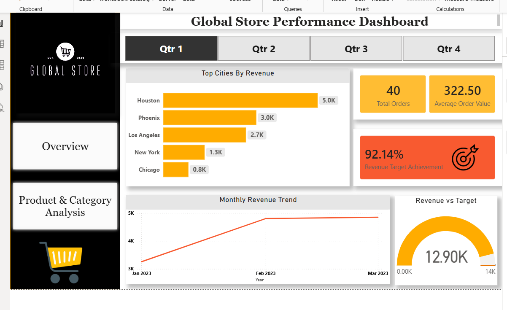
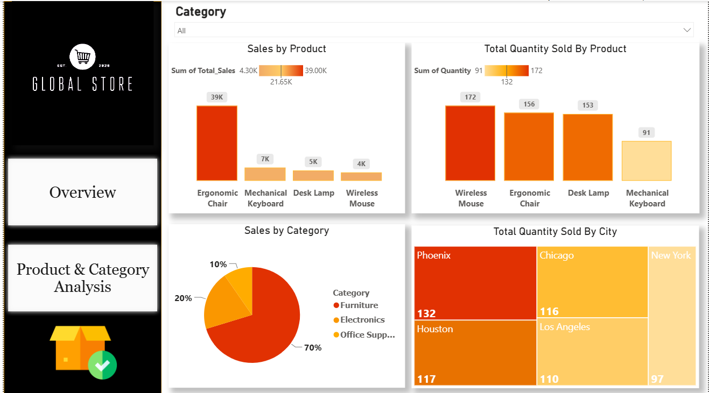

# 🛒 Global Store E-Commerce Analysis

## 📌 Project Overview
An end-to-end data analysis project 
analyzing e-commerce sales data to 
uncover business insights using 
MySQL and Power BI.

---

## 🛠️ Tools Used
- MySQL — Data exploration, cleaning & validation 
- Power BI — Dashboard & visualization
- DAX — Calculated measures

---

## 🔄 Project Pipeline
Raw Data → Data Cleaning → 
Star Schema → Dashboard → Insights

---

## 📊 Dashboard Preview

---

## 💡 Key Business Insights
1. Ergonomic Chair generates 39K which 
   is 70% of total revenue making it 
   the most critical product for 
   the business.

2. Wireless Mouse sold the most units 
   (172) but earned the least revenue 
   (4K) while Ergonomic Chair earned 
   39K from just 156 units proving 
   that high volume does not always 
   mean high revenue.

3. New York earned the lowest revenue 
   of 7K despite being a major market 
   while Phoenix led all cities with 
   15.2K indicating a clear untapped 
   growth opportunity in New York.

4. Furniture alone drives 70% of total 
   revenue with Electronics contributing 
   20% and Office Supplies only 10% 
   which makes the business heavily 
   dependent on a single category 
   and creates a significant risk.

5. September 2023 was the lowest 
   performing month of the entire year 
   indicating a seasonal dip that 
   requires planned promotional attention.

6. The sales standard deviation of 331.39 
   exceeds the median order value of 125 
   which means revenue is largely driven 
   by occasional large orders rather than 
   consistent customer spending making 
   it unpredictable.

---

## ✅ Business Recommendations
1. Maintain strong stock levels for 
   Ergonomic Chair at all times as 
   it drives 70% of total revenue

2. Bundle Wireless Mouse with Mechanical 
   Keyboard or Desk Lamp as combo offers 
   to increase revenue per order

3. Increase marketing focus on New York 
   to unlock its underperforming 
   but high potential market

4. Promote Electronics and Office Supplies 
   more actively to reduce dependency 
   on the Furniture category

5. Run discount offers and sales 
   campaigns in September every year 
   to attract more customers during 
   the lowest performing month

6. Encourage medium value orders in the 
   250 to 500 range to build more 
   consistent and predictable revenue
---

## 📁 Repository Structure
- Data — Raw dataset
- SQL— All SQL queries
- Dashboard — PDF dashboard
- Screenshots — Dashboard previews

---

## ⚠️ Limitations
1. Small Dataset
   Only 192 records however the variety 
   of errors made it sufficient to 
   demonstrate a complete data 
   cleaning workflow.

2. Single Year Data
   Data covers only 2023 so year 
   over year comparison is not possible.

3. NULL Dates affect monthly trend,
   some records have missing dates 
   making monthly trend approximate.
   Rows were kept intentionally to 
   preserve valid sales and quantity data.

4. No profit data
   dataset only contains revenue,
   actual profitability of products 
   and cities cannot be determined.
